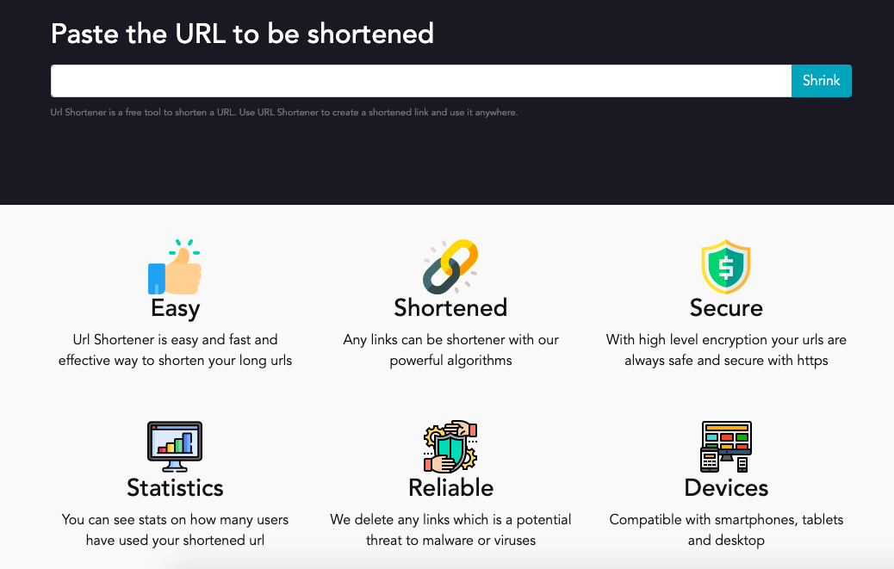
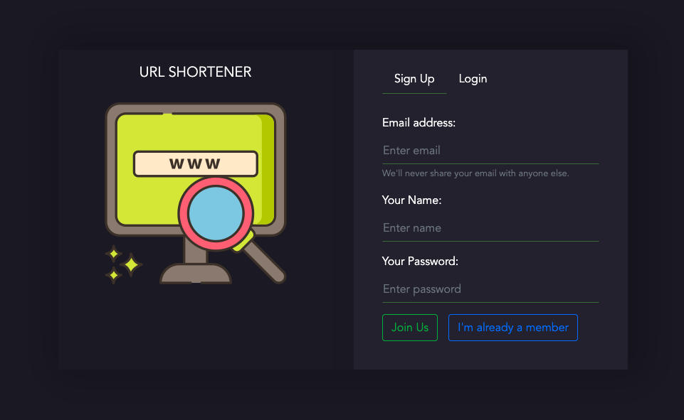

## Scalable URL Shortener Web Application



A full E2E application to shorten your urls and save it on your profile. It gives you flexibity to choose your domain names, or build custom urls in paid version. The trial is free to use and you canshorten unlimited number of urls.

### See It Live
[Working Demo](https://razorurl.herokuapp.com/)

### Getting Started
To get you started you can simply clone the repository:

```
git clone https://github.com/Rajdeepc/url-shortener-vue.git
```

### Pre-requisites
You need git to clone the repository. You can get git from
[http://git-scm.com/](http://git-scm.com/).

A number of node.js tools is necessary to initialize and test the project. You must have node.js and its package manager (npm) installed. You can get them from  [http://nodejs.org/](http://nodejs.org/). The tools/modules used in this project are listed in package.json and include express, mongodb and mongoose.

Download express,mongodb and mongoose from the below sites:
 - Express [https://www.npmjs.com/package/express](https://www.npmjs.com/package/express)
 - Mongoose [https://www.npmjs.com/package/mongoose](https://www.npmjs.com/package/mongoose)
 - MongoDB [https://www.npmjs.com/package/mongodb](https://www.npmjs.com/package/mongodb)

### Installing

and install the dependencies
```
npm install
```

#### Lint & Build

```sh
npm run lint
npm run build
```

### Running the tests
```
npm test
```

### Run in Local

To Run Locally Steps to follow:

* Run Front End
```
npm run serve
```

* Run Back End
    - cd backend
```
nodemon index.js (install npm  install nodemon -g)
```

### Built With

* [Vue js](https://github.com/facebook/vue/).
* [mongodb](https://github.com/mongodb/mongo)
* [Mongoose](https://github.com/Automattic/mongoose)
* [Node JS](https://nodejs.org/en/)
* [bycrypt](https://github.com/kelektiv/node.bcrypt.js/)
* [Hapi JS](https://github.com/hapijs/hapi)


## Contributing

Please follow the [Contributing](./github/CONTRIBUTING.md) guidelines to open a pull request

### Some Glimpses:

## Login Page



### License

This project is licensed under the MIT License - see the [LICENSE.md](./github/LICENSE.md) file for details

### Become a Patreon
Made for developers and designers by Rajdeep Chandra. Tip me on [Patreon](https://www.patreon.com/chandraraj).
