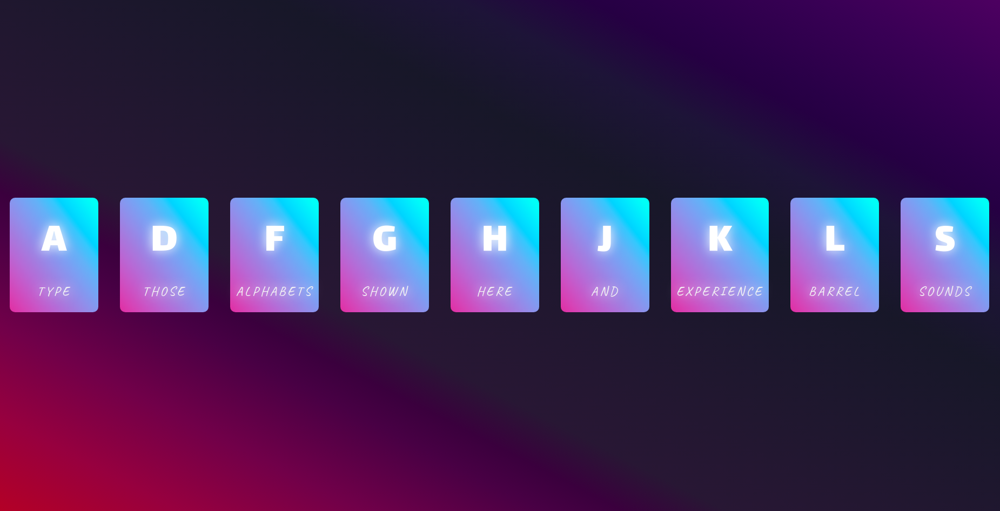
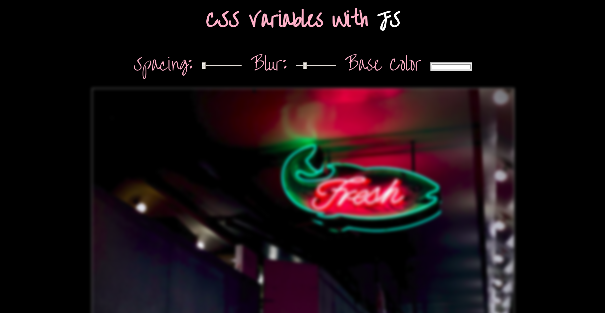
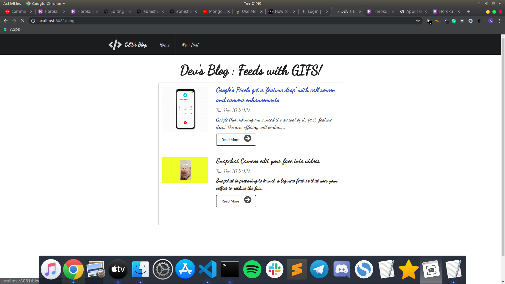

# JAVASCRIPT 30 Days Challenge :

## Day 0 : Music Player

## Day 1 : Drum Kit

Link : https://abhisheknaiidu.github.io/JavaScript30/Day1/

## Day2 : Clock With Hour, Minute and Seconds Hand

Link : https://abhisheknaiidu.github.io/JavaScript30/Day2/

## Day3 : JS Effects

Link : https://abhisheknaiidu.github.io/JavaScript30/Day3/

## Day4 : JS Flex Effects

Link : https://abhisheknaiidu.github.io/JavaScript30/Day4/

## Day5 : Hamburger Nav-Bar

## Day6 : JS Type-Writer Effect

Link : https://abhisheknaiidu.github.io/JavaScript30/Day6/

## Day7 : JS Fastest Finger Game!

## Day8 : Movie App With Node.JS 

## Day9-Day12 : Dev's Blog

Link : https://github.com/abhisheknaiidu/Dev-s-Blog

## Day13-Day14 : Working With Api's ft. Github API

Link : https://github.com/abhisheknaiidu/JavaScript30/tree/master/react/github_api

## Day 15 : Local Storage and Event Delegation

## Currency Exchange Rate Calculator
Javascript application for checking real time currency rates. 

